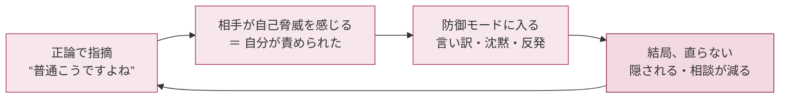
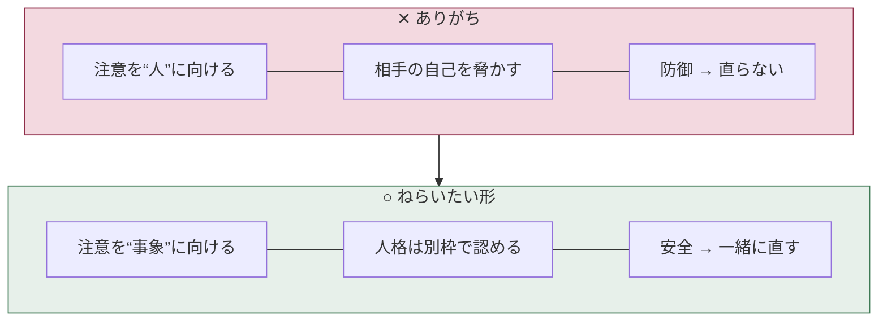
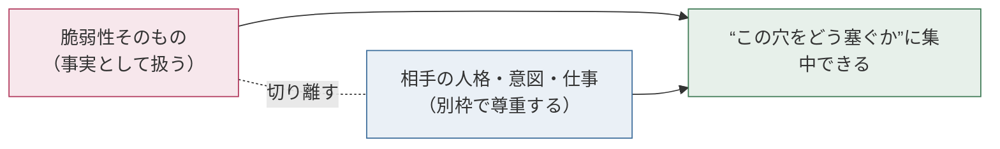
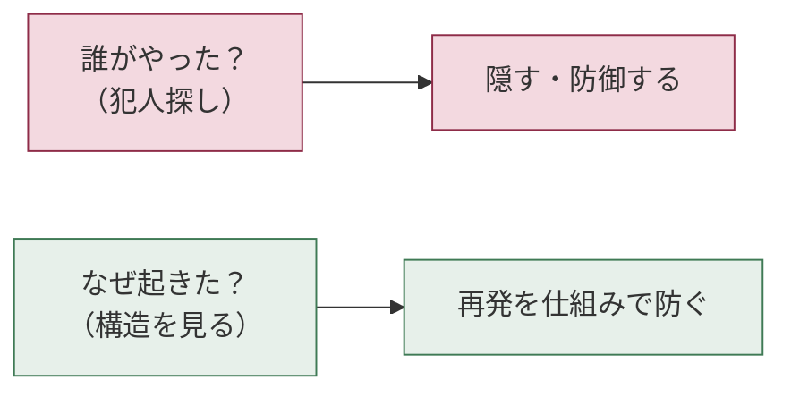
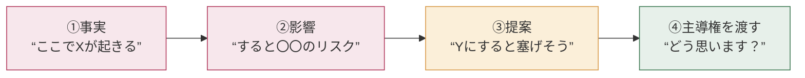
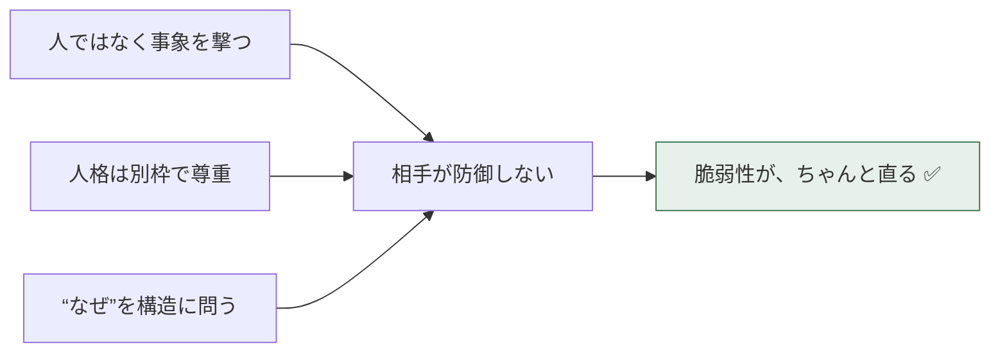

# 「そのやり方、危ないですよ」── その一言、相手はちゃんと受け取れていますか？ 🐰🌸

> こんにちは、うさうさです🐰
> これは「正解を教えます」という記事ではありません。**一緒に考えるための、問いかけ多めのメモ**です。読みながら、ご自分の現場を思い浮かべてもらえたら嬉しいです。

---

## はじめに ── ちょっと、思い出してみてください

> 🌸 **問い1**
> あなたが最近、誰かに「ここ、間違ってますよ」と指摘されたとき。
> ──そのとき最初に湧いたのは「なるほど！」でしたか？　それとも、ほんの一瞬でも「うっ」と身構えませんでしたか？

私はだいたい、後者です。正しい指摘なのに、なぜか一瞬カチンとくる。で、自分が指摘する側になると、今度は相手に同じ顔をさせてしまう。

私が昔よくやっていた言い方は、これでした。

> 「ここ、SQLインジェクション通りますよ。**普通エスケープしますよね？**」

言ってることは、たぶん正しい。でも相手は黙り込み、PRはなかなか直らず、気まずくなって、次から相談が来なくなる。**正しさで勝って、安全を失った**わけです。

もう一つ問いです。

> 🌸 **問い2**
> セキュリティの指摘がうまくいかないのは、相手が「サボってる」「能力が低い」から？
> それとも、別の何かが起きている？

私はずっと前者だと思っていました。でも研究を読んで、考えが変わりました。少し一緒に見てみませんか。

---

## 何が起きているのか ── たぶん「能力の問題」ではない

私がハマっていた悪循環を、まず図にしてみます。

この図を見て、どう感じますか。私が「なるほど」と思ったのは、**この循環のどこにも"悪い人"がいない**こと。人間の標準仕様として、こう回ってしまう。それを示す研究を3つだけ。

### 1.「人」に向いた指摘は、むしろ逆効果になりやすい

> 🌸 **問い3**：フィードバックは、すればするほど成績が上がる。…本当にそう？

直感に反するのですが、Kluger と DeNisi（1996）が607件の効果量・2万件超の観察を集めたメタ分析では、**全体の3分の1以上のフィードバックが、かえって成績を下げていました**[^1]。

しかも彼らの理論では、フィードバックが受け手の注意を**「課題そのもの」ではなく「自分（自己）」に向けてしまうと、効果が落ちやすい**とされます[^1]。

> つまり「**あなた**、これダメですよ」と人に向けるほど、相手の注意は"傷ついた自分"に持っていかれて、肝心の修正から遠ざかる。私の「普通こうですよね？」は、相手の自己を撃ち抜いていたわけです。

### 2. 自分が脅かされると、人は事実より「防御」を選ぶ

> 🌸 **問い4**：自分のコードの穴を指摘されたとき、人はまず「事実」を見る？　それとも、まず「自分」を守る？

Sherman と Cohen（2006）の自己肯定理論によれば、人は自分の価値が脅かされると、**脅威の情報そのものを歪めたり否定したりして自分を守ろうとする**[^2]。一方で、脅かされた領域とは**別の**自己価値に触れる機会があると、この防御がやわらぐ[^2]。

コードは「自分の分身」みたいなところがありますよね。だから穴を突かれると、事実を事実として受け取れなくなる。

### 3.「安全だ」と感じられる場でだけ、人は問題を正直に出す

> 🌸 **問い5**：あなたのチームでは、ジュニアが「これ、自信ないので見てください」と言えますか？

Edmondson（1999）は製造業の51チームを調べ、**心理的安全性（対人リスクを取っても大丈夫だという共有された感覚）が高いチームほど、メンバーが問題を率直に出し、ミスを認め、学習する**ことを示しました[^3]。

セキュリティで一番怖いのは、指摘そのものより**「怒られるから黙っておこう」と問題が隠されること**。隠された脆弱性は、直りません。

---

## では、どう言えばいいんだろう ── 一緒に考えてみる

研究をまとめると、向かう先はこんな形でした。

ここからは私が試して「お、マシかも」と思えたものです。**正解ではなく、たたき台**として読んでください。

### 原則：人ではなく、事象（コード・設定・構成）を撃つ

> 🌸 **やってみる問い**：次の左側、どこが「人」を撃っているでしょう？　右に直すなら、あなたならどう書きますか？

| ✕ 人に向く言い方 | ○ 事象に向く言い方 |
|---|---|
| 「**あなた**、エスケープ忘れてますよ」 | 「**この入力**、エスケープが入ると安全になりますね」 |
| 「**なんで**バリデーション入れてないんですか」 | 「**この経路**、バリデーションがあると塞げそうです」 |
| 「普通そこは権限分けますよね」 | 「ここ、**権限を分けると**事故ったとき被害が小さくなりますね」 |
| 「設定ミスってます」 | 「**この設定値**、`X`にすると想定挙動になりそうです」 |

右側、誰も責めていませんよね。穴の話だけしている。**直すべきは"その人"ではなく"そのコード"**。これが伝わると、相手も一緒に画面を覗き込んでくれます。

### 「ほめ→けなし→ほめ」のサンドイッチは、思ったほど効かないかも

正直に書きます。サンドイッチ法、私はあまり手応えがありませんでした。研究が「ダメ」と直接言っているわけではないのですが、Klugerらの知見をふまえると、ほめ→けなし→ほめは**相手の注意を何度も"自分（人）"に向け直してしまう**[^1]。だから私は、終始"事象"に注意を置くほうが伝わると感じています。

### プライドは「別の土俵」で守る

Sherman & Cohen の知見で面白いのは、自己肯定は**脅かされた領域とは別の場所**で効く点です[^2]。

つまり、穴を指摘する直前に「コード綺麗ですね（からの、でもここ穴）」と**同じ土俵**でほめても、取ってつけた感が出て逆効果になりがち。そうではなく、**相手の意図・目的・これまでの仕事**を、問題そのものと切り離して認めるほうが筋がいい、と解釈しています。

私がよく使う軽い前置きはこんな感じです。

> 「**急ぎで仕上げてくれて助かりました。** そのうえで、リリース前に一個だけ一緒に潰しておきたい箇所があって──」

意図は認めつつ、穴は穴として淡々と扱う。人とコードを、口頭でそっと分けておく感じです。

### 「誰が」ではなく「なぜ起きたか」── blameless で

問いの矢印を「誰が」から「なぜこの構造だと起きるのか」に向けると、相手は守りに入らずに済む。自然と次の仕組み化（lint・CI・テンプレ・レビュー観点）の話になります。

### 指摘の型 ── 私が使っている4ステップ

最後の④（主導権を相手に戻す）が地味に効きます。「こうしろ」で終わらせず「どう思います？」で渡すと、相手が"自分で直すことにした"形になる。命令されて直すより、ずっと気持ちよく直してもらえます。

---

## 言い換えメモ（よかったら引き出しに）

| 場面 | 身構えさせがちな言い方 | 私が今は使う言い方 |
|---|---|---|
| 脆弱性を見つけた | 「これ普通にアウトです」 | 「ここ、リリース前に一緒に塞いでおきたいです」 |
| 設定ミス | 「設定間違ってますよ」 | 「この値、`X`が想定挙動だと思うのですが、意図ありますか？」 |
| 既知の悪手 | 「アンチパターンですよ」 | 「過去にここでハマったことがあって、共有させてください」 |
| 何度も同じ穴 | 「また同じミス…」 | 「ここ繰り返し出るので、lintで機械に拾わせませんか」 |
| 強めに反論された | 「いや危ないですって」 | 「リスクの見え方を揃えたいので、どこが気になるか教えてください」 |

「アンチパターンですよ」を「私も昔ハマりました」に変えるだけで、**上下が消えて横並びになる**。これが一番効いた気がします。

---

## おわりに ── 最後の問い

> 🌸 **問い6**
> あなたの直近のレビューコメント、もう一度読み返すとしたら。
> それは「コード」を見ていましたか？　それとも、いつのまにか「人」を見ていましたか？

これは「優しくしましょう」という道徳の話ではなく、わりと**実利の話**だと思っています。

プライドを守るのは、相手のためというより、**そのほうが穴がちゃんと塞がるから**。正論で勝っても穴が残ったら、セキュリティとしては負けですもんね。

…と、えらそうに書きましたが、私も今日もどこかで「普通こうですよね」と言ってしまっている気がします。お互い、ぼちぼちいきましょう。🐰🌸

ではまた。面白きこともなき世を、面白く。
**— うさうさ（うさうさ研修工房）**

---

## 参考文献（すべて実在の査読論文）

[^1]: Kluger, A. N., & DeNisi, A. (1996). The effects of feedback interventions on performance: A historical review, a meta-analysis, and a preliminary feedback intervention theory. *Psychological Bulletin, 119*(2), 254–284. https://doi.org/10.1037/0033-2909.119.2.254

[^2]: Sherman, D. K., & Cohen, G. L. (2006). The psychology of self-defense: Self-affirmation theory. In M. P. Zanna (Ed.), *Advances in Experimental Social Psychology, 38*, 183–242. Elsevier. https://doi.org/10.1016/S0065-2601(06)38004-5

[^3]: Edmondson, A. C. (1999). Psychological safety and learning behavior in work teams. *Administrative Science Quarterly, 44*(2), 350–383. https://doi.org/10.2307/2666999

---

> ※ blameless postmortem は IT/SRE 現場で広く使われる実務的な考え方として触れています（特定の査読論文を典拠とするものではありません）。心理的根拠としては上記 Edmondson(1999) を参照しています。
> ※ 最適解は社内文化・契約・人事評価の文脈で変わります。一個人の試行錯誤メモとして読んでいただけたら幸いです。

<!-- 作成日：2026-06-22 / version v3.0（問いかけ・考えさせる版）/ うさうさ研修工房 -->
